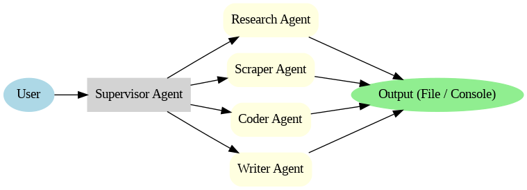
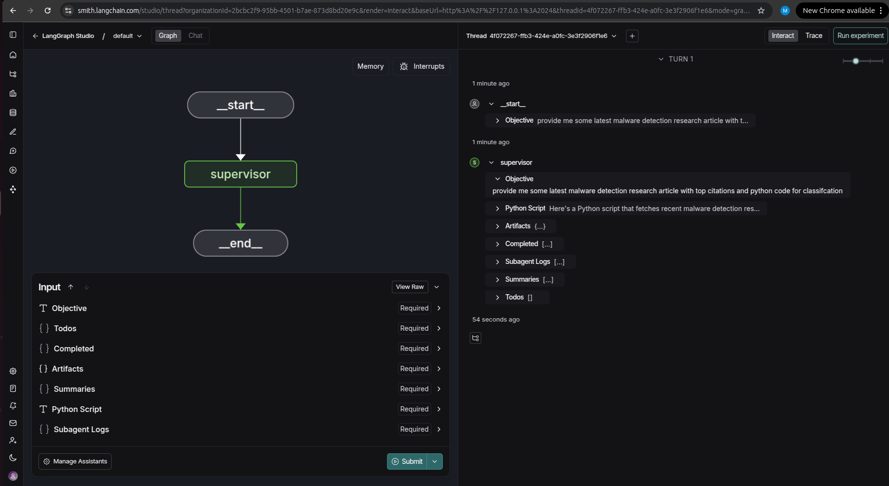
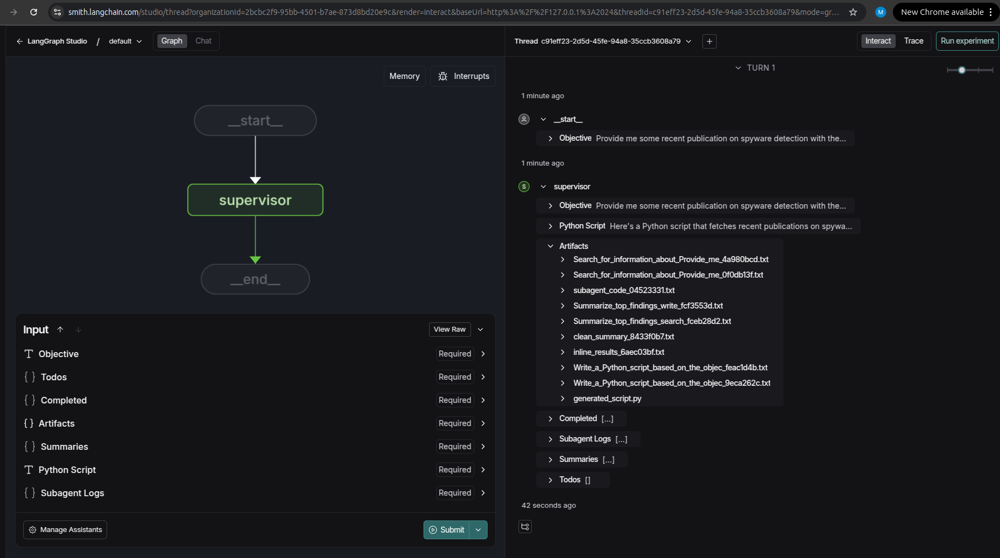
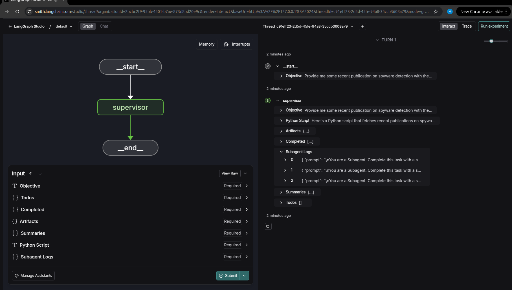
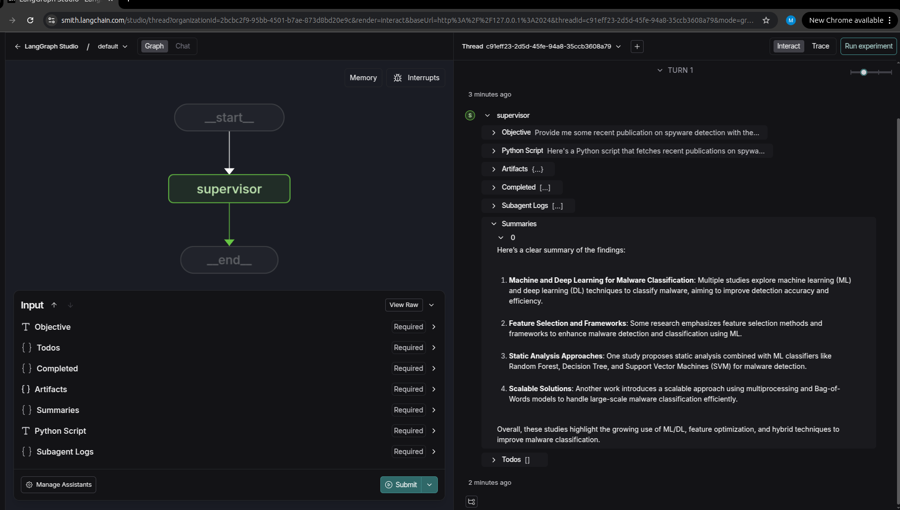

# LangGraph Supervisor Demo

This project implements a **LangGraph Supervisor Agent**. The supervisor coordinates specialized worker agents that handle subtasks like research, summarization, scraping, and code generation.

---

##  How the Agent Works
- **Input**: The user provides an objective (e.g., *"Research phishing URL detection papers 2024, summarize, and generate Python script"*).  
- **Supervisor Agent**: Interprets the objective and delegates subtasks.  
- **Worker Agents**: Execute tasks such as:
  - Research & summarization
  - Web scraping
  - Python script generation
  - File writing
- **Output**: Results are written to a file or printed depending on requirements.

---

## Architecture Overview
- **Supervisor Agent**  
  Coordinates workflow and decides which worker agent to call.

- **Worker Agents**  
  - *Research Agent*: Searches and summarizes papers.  
  - *Scraper Agent*: Extracts data from websites.  
  - *Coder Agent*: Generates Python code when required.  
  - *Writer Agent*: Saves results to `.txt` files.  

**Flow Diagram**


---

##  Environment Setup
### Requirements
- Python **3.12+**
- [LangGraph](https://github.com/langchain-ai/langgraph)
- [LangChain](https://python.langchain.com)
- OpenAI / OpenRouter compatible LLM key

### Install Dependencies
```bash
git clone https://github.com/Muzamilkhan7860/Assignment_project
cd Assignment_project
pip install -r requirements.txt

```

### API Keys
Create a `.env` file in the root directory:
```
PROJECT_ARTIFACT_DIR=./artifacts
OPENROUTER_API_KEY=your_key_here
TAVILY_API_KEY=your_key_here
LANGSMITH_API_KEY=your_key_here
LANGCHAIN_TRACING_V2=true
LANGCHAIN_PROJECT=LangGraph-Supervisor-Demo  

```

---

## Running the Project
### Local CLI
```bash
python3 main.py
```

You’ll be prompted for an objective. Example:
```
Enter user objective: Research phishing URL detection papers 2024, summarize, and save to file.
```

### LangGraph Studio
```bash
langgraph dev
```
This will open the LangGraph Studio UI in your browser.
Enter Objective: Provide me some recent publication on spyware detection with the help of machine learning also provide me python code for classification.


---

## Screenshot of LangGraph Studio

The screenshot below shows the **LangGraph Supervisor Demo** running in **LangGraph Studio** after starting the project with `langgraph dev`.  
You can see the interface where user objectives are entered and worker agents process tasks in real time.







---


##  AI Assistance Disclosure
This project was partly developed using AI assistance.  
Example prompt given to ChatGPT:
For a full list of prompts, see [PROMPTS.md](./PROMPTS.md).
